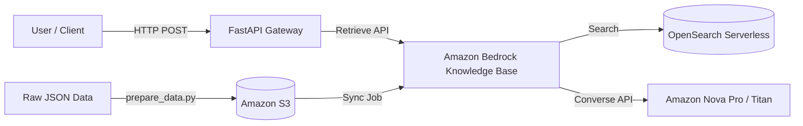

# Serverless RAG Engine on Amazon Web Services (AWS)

[](https://www.python.org/)
[](https://aws.amazon.com/bedrock/)
[](https://aws.amazon.com/serverless/)
[](https://opensource.org/licenses/MIT)

A serverless Retrieval-Augmented Generation (RAG) system built natively on AWS. Originally prototyped for Wine Data Analytics using the [Wine Reviews Dataset from Kaggle](https://www.kaggle.com/datasets/zynicide/wine-reviews), this engine has been architected to be completely domain-agnostic (i.e. you can plug in any dataset by simply updating a JSON schema configuration).

---

## Repo Structure

```text
├── config/                  # Configuration files (Domain schema and Runtime App config)
├── data/                    # Datasets (Ignored by Git to prevent data leaks)
├── src/
│   ├── api/                 # FastAPI application layer
│   ├── core/                # Core business logic (AWS Clients, Config Managers)
│   └── scripts/             # Operational, Provisioning, and Data Prep scripts
├── requirements.txt         # Python dependencies
├── roadmap.md               # Commit guidelines and project history
└── README.md                # This documentation
```

---

## Architecture

This project leverages AWS managed services to eliminate infrastructure overhead while maximizing scalability and security.



### Core Components
- **Amazon Bedrock Knowledge Bases**: Orchestrates the entire retrieval pipeline and automatic chunking.
- **Amazon OpenSearch Serverless (AOSS)**: High-performance vector database using the FAISS engine (HNSW algorithm).
- **Amazon Bedrock Runtime**: Employs foundation models (e.g., Nova Pro) for generating intelligent, context-aware responses.
- **Amazon S3**: Acts as the robust data source bucket for bulk document ingestion.
- **AWS IAM**: Implements strict role-based access control (RBAC) following the principle of least privilege.

---

## Prerequisites

Ensure you have the following installed and configured:

1. **AWS Account & CLI**: Configured with a user that has Admin permissions (or sufficient permissions to create IAM roles, S3 buckets, Bedrock KB, and AOSS collections).
   ```bash
   aws configure
   ```
2. **Python 3.9+**: Ensure `pip` and `venv` are available.
3. **jq**: Required for parsing JSON in the Bash deployment script.

---

## Quick Start

Follow these steps to deploy and test the system in your AWS environment.

### 1. Clone & Setup
```bash
git clone https://github.com/your-username/enterprise-aws-rag.git
cd enterprise-aws-rag

# Create and activate virtual environment
python3 -m venv .venv
source .venv/bin/activate

# Install dependencies
pip install -r requirements.txt
```

### 2. Prepare the Dataset
Assuming you have a raw JSON dataset (e.g., `data/raw.json`):
```bash
python src/scripts/prepare_data.py \
    --input data/raw.json \
    --outdir data/processed
```
*Note: This splits the data into AWS Bedrock-compliant CSV chunks and generates the required `.metadata.json` mapping files based on your schema.*

### 3. Provision Infrastructure
Run the automated deployment script. This will create the IAM roles, S3 bucket, AOSS Vector Store, Bedrock Knowledge Base, and trigger the initial data sync.
```bash
bash src/scripts/deploy_rag.sh
```
*Wait for the script to finish. It will automatically write the infrastructure IDs to `config/app_config.json`.*

### 4. Query the System

**Via CLI:**
```bash
python src/scripts/query_cli.py "What are the best red wines under 50 euros?" --prezzo 50.0
```

**Via API Gateway:**
```bash
# Start the FastAPI server
uvicorn src.api.main:app --reload
```
Test the API endpoint:
```bash
curl -X POST "http://localhost:8000/api/chat" \
     -H "Content-Type: application/json" \
     -d '{"query": "Find me a Tuscan wine", "filters": {"provincia": "Tuscany"}}'
```

---

## Domain Customization

Adapting this RAG to a completely different domain (e.g., Legal Documents, Medical Records, IT Tickets) is trivial.

1. Open `config/domain_schema.json`.
2. Define your new metadata fields:
   ```json
   {
     "domain_name": "LegalDocs",
     "content_field": "document_text",
     "id_field": "case_id",
     "metadata_fields": [
       { "name": "jurisdiction", "type": "string" },
       { "name": "year", "type": "integer" }
     ]
   }
   ```
3. Run `prepare_data.py` on your new dataset.
4. Run `deploy_rag.sh`. The OpenSearch index mappings and Bedrock structure configuration will be automatically generated to match your new fields!

---

## License

This project is licensed under the MIT License. See the [LICENSE](LICENSE) file for details.
